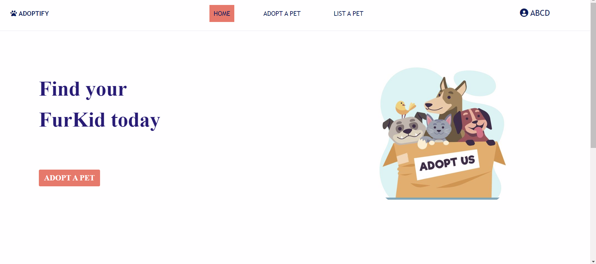
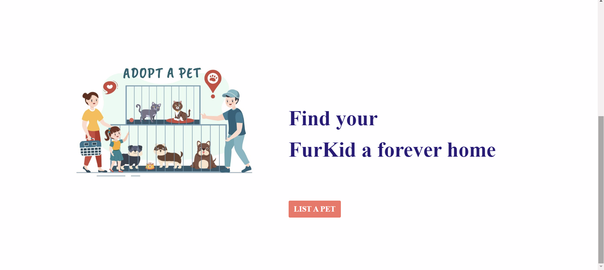
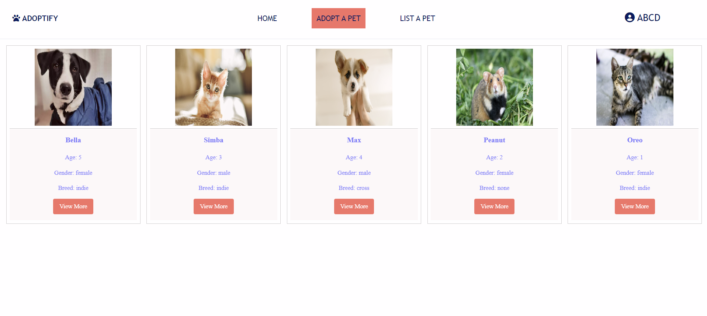
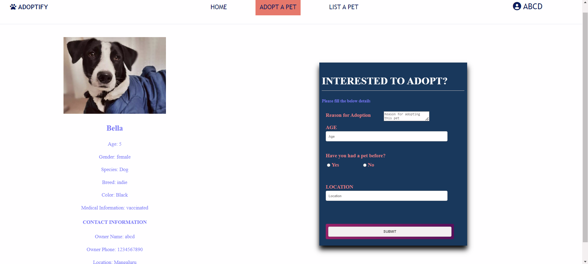
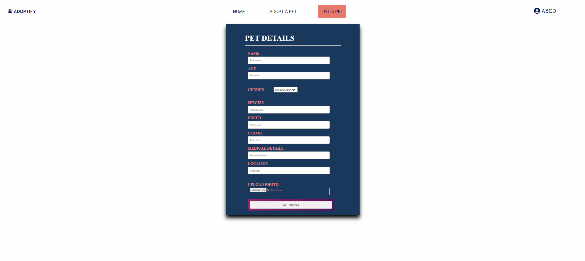
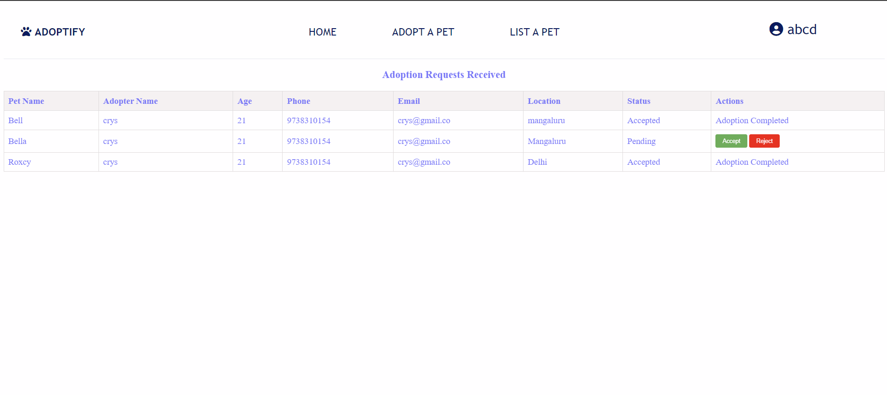
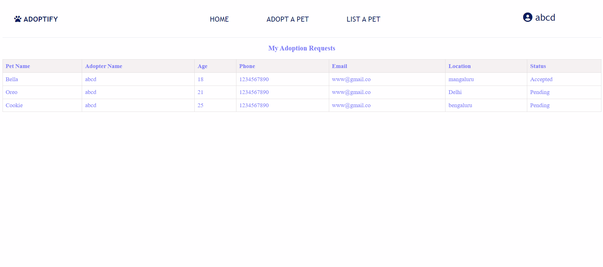

# Adoptify

**Adoptify** is a web application designed to facilitate pet adoption, connecting users with pets in need of homes through a simple and interactive interface.

## Features

- **Browse Pets:** View a list of pets available for adoption.
- **Search & Filter:** Easily find pets by breed, age, or location.
- **Pet Details:** Access detailed information about each pet.

## Technologies

- **HTML, CSS, JavaScript** for the front end.
- **MySQL** for database management.
- **PHP** for server-side processing.

## Screenshots

  
  
   
  <i>Home Page</i>

  
  
   
 <i>Pet Gallery & Details Page</i>

  
   
  <i>Pet Listing Page</i>

  
  
   
  <i>Adoption Requests & Status Page</i>

